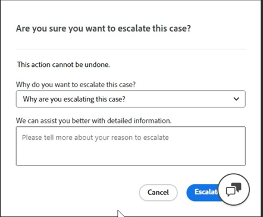

# Adobe Commerce용 Experience League 지원 사용 안내서

이 안내서에서는 [지원 Experience League](https://experienceleague.adobe.com/home#support)에 지원 티켓을 제출하고 Adobe Commerce 계정에 대한 공유 액세스 권한을 제공하는 방법에 대해 알아봅니다.

>[!NOTE]
>
>Adobe Commerce 지원이 Adobe Commerce 도움말 센터에서 Experience League으로 마이그레이션되었습니다. [여기](#what-is-experience-support)에 설명된 Experience League 사례 양식 흐름을 사용하여 지원 사례를 제출하십시오.

>[!NOTE]
>
>Adobe Commerce 도움말 센터의 기술 자료 부분이 Adobe Experience League 포털로 마이그레이션되었습니다. 지원 티켓을 만들면 Adobe Experience League의 기타 관련 Adobe Commerce 설명서와 함께 관련 기술 자료 문서가 제안됩니다.

**주요 업데이트:** 2024년 7월 29일

**[EXPERIENCE LEAGUE 지원이란?](#what-is-experience-support)**

**[지원 사례](#support-cases)**

* [Experience League 지원에 로그인](#sign-in-experience-support)
* [지원 사례 제출](#submit-case)

   * [Adobe Experience League 시작 페이지](#experience-league-start-page)
   * [Adobe Commerce 계정 페이지](#submit-case-adobe-commerce-account-page)
   * [*이메일 주소를 확인하십시오.*](#verify-email-address-error)

* [지원 사례 추적](#track-support-cases)
* [서비스 케이스의 댓글](#comments-in-your-case)
* [서비스 케이스 닫기](#close-case)
* [서비스 케이스 다시 열기](#reopen-case)
* [Cloud Console을 사용하여 티켓 제출](#cloud-console)
* [Adobe Commerce 핫라인](#P1-hotline)
* [Adobe Commerce 공유 책임 운영 모델](#shared-responsibility-operational-model)

**[공유 액세스: 다른 사용자가 귀하의 계정에 액세스할 수 있는 권한을 부여합니다](#shared-access)**

* [공유 액세스 권한을 제공할 수 있는 사람](#who-can-provide-shared-access)
* [공유 액세스 권한 제공](#provide-shared-access)
* [공유 액세스 취소(삭제)](#revoke-shared-access)

   * [Cloud 프로젝트를 통해 공유 액세스 권한이 부여된 사용자를 삭제하는 방법](#remove-cloud-shared-access-users)

* [공유 계정 액세스(계정 전환)](#switch-accounts)
* [공유 액세스 문제 해결](#troubleshooting-shared-access)

**[ADOBE COMMERCE에 대한 청구 FAQ](#billing-faq)**

## Experience League 지원이란? {#what-is-experience-support}

Experience League 지원은 자격을 갖춘 Adobe Commerce 고객이 지원 티켓을 제출하고 관리할 수 있는 Adobe을 위한 지원 포털입니다. 또한 문제 해결 문서를 검토할 수 있습니다.

## 지원 사례 {#support-cases}

Adobe Experience League 지원 사례 관리를 사용하면 계약에 따라 모든 Adobe Commerce 제품에 Adobe Commerce 등 Adobe 제품을 사용하는 동안 발생하는 특정 문제를 해결하기 위해 사례를 통한 지원 작업을 할 수 있습니다.

## Experience League 지원에 로그인 {#sign-in-experience-support}

로그인을 사용하면 지원 티켓에 대한 에이전트의 질문을 제출, 업데이트 및 응답할 수 있습니다.

Adobe Experience League 지원에 로그인하려면 다음 단계를 따르십시오.

1. [experienceleague.adobe.com](https://experienceleague.adobe.com/)(으)로 이동합니다.
1. Adobe 로그인 자격 증명을 사용하여 로그인합니다.

### 지원 사례 제출 {#support-case}

성공적으로 로그인되면 Adobe Experience League 홈페이지, Adobe Commerce 계정 페이지 및 Adobe Commerce Cloud 계정 페이지를 사용하여 지원 사례를 제출할 수 있습니다.

* 계정 소유자인 경우 아래 단계를 수행합니다.
* 공유 액세스 사용자인 경우 먼저 계정을 전환해야 합니다. [공유 계정 액세스(계정 전환)](https://experienceleague.adobe.com/en/docs/commerce-knowledge-base/kb/help-center-guide/magento-help-center-user-guide#switch-accounts)를 확인한 후 아래 단계를 진행할 수 있습니다.

#### Adobe Experience League 시작 페이지 {#experience-league-start-page}

Adobe Experience League의 시작 페이지를 사용하여 새 지원 사례를 제출하려면 다음 단계를 따르십시오.

>[!INFO]
>
>1. 사례를 제출하려면 적절한 제품(예: Adobe Commerce, Adobe Commerce Intelligence, Experience Platform 등)에 대한 지원을 받을 자격이 있어야 합니다. 지원 권한이 없는 경우 조직의 지원 권한이 있는 사용자가 아님을 알리는 표시줄이 페이지 맨 위에 나타납니다.
>1. 여러 조직에 속해 있거나 유사한 이름의 조직이 여러 개 있는 경우(각 조직은 조직이 구독하는 다른 Adobe 제품을 나타냄) 먼저 드롭다운에서 적절한 조직을 선택해야 합니다.

>[!NOTE]
>
>사례를 제출하기 전에 올바른 조직을 선택했는지 그리고 선택한 조직에 지원을 요청하는 제품에 대한 적절한 권한이 있는지 확인합니다. 예를 들어, 문제가 Adobe Commerce과 관련되어 있지만 Experience Platform을 제품으로 선택했고 케이스가 성공적으로 제출된 경우 케이스가 잘못 라우팅되고 응답 시간이 지연될 수 있습니다.
>
>또한 잘못된 조직을 선택한 경우 팀은 [!UICONTROL My Cases]에서 해당/올바른 조직의 사례를 볼 수 없습니다. 지원 팀은 향후 사례와 관련된 조직을 변경할 수 없습니다.

1. 헤더에서 **지원**&#x200B;을 클릭합니다. 지원 홈 페이지가 열립니다.

   

1. 지원 접수 프로세스를 시작하려면 조직 드롭다운 목록(표시되는 경우)에서 적절한 조직을 선택했는지 확인합니다.

   

1. 왼쪽 메뉴에서 **[!UICONTROL Open Ticket]**&#x200B;을(를) 클릭하거나 *[!UICONTROL Open a support ticket]* 카드에서 **[!UICONTROL Get Started]**&#x200B;을(를) 클릭합니다.

   

1. 드롭다운 메뉴에서 제품을 선택하고 사례 제목과 설명을 입력합니다. 참고: 드롭다운에 제품이 표시되지 않거나 Commerce을 사용할 수 있는 옵션이 없는 경우 왼쪽 열에서 조직을 전환하고 다시 확인해 보십시오.

   

1. Adobe Experience League은 사례를 해결하는 데 도움이 되는 문서와 모범 사례를 제안합니다. 여전히 직접 지원이 필요한 경우 사례를 제출하기 전에 몇 가지 추가 정보를 제공해야 합니다.

   

1. 필요한 정보를 모두 입력했으면 **[!UICONTROL Submit case]**&#x200B;을(를) 클릭합니다.

>[!IMPORTANT]
>
>experienceleague.adobe.com에 로그인할 때 조직 드롭다운 메뉴에서 조직을 볼 수 없는 경우 지원을 요청하거나 기존 지원 사례를 관리하기 전에 accounts.magento.com 과 프로필을 동기화해야 할 수 있습니다.   
>
>1. accounts.magento.com으로 이동한 다음 Adobe Experience League에서 지원 사례를 관리하는 데 사용할 동일한 프로필(회사, 학교 또는 개인)로 로그인합니다. 
>1. accounts.magento.com 프로필에 성공적으로 로그인했으면 experienceleague.adobe.com으로 다시 이동하여 로그인합니다. 
>1. 조직 드롭다운 메뉴에서 조직을 선택합니다. 
>1. 조직이 여전히 나타나지 않으면 Commerce 관리자에게 문의하여 지원 위임 권한을 받으십시오. 자세한 내용은 [Commerce 계정 공유](https://experienceleague.adobe.com/en/docs/commerce-admin/start/commerce-account/commerce-account-share) 도움말 문서를 참조하십시오. 

>[!NOTE]
>
>조직/제품이 중요한 이유
>
>**예제 A**: 한 회사에 대한 액세스 권한만 공유했으며 해당 회사에는 Product1과 Product2라는 두 Adobe 제품에 대한 사용 권한이 있습니다.
>1. 각 조직은 하나의 제품을 나타내므로 드롭다운에 OrgA-Product1 및 OrgB-Product2와 같은 두 개의 조직이 표시됩니다.
>1. Product = Product1을 선택했지만 문제가 Product2와 관련된 경우, 케이스는 Product2 지원으로 라우팅되며 Product1 지원으로 케이스를 전송할 때 지연이 발생합니다.
>1. OrgA-Product1에 대한 사례를 제출하고 나중에 해당 조직에 대한 [!UICONTROL My Cases]을(를) 검토하려는 경우 OrgA-Product2를 조직으로 선택하면 표시되지 않습니다(예 B와 비교하여 다른 조직을 선택하기만 하면 됨).
>
>**예제 B**: 두 회사에 대한 공유 액세스 권한이 있으며 각 회사에는 Adobe Commerce에 대한 권한만 있습니다.
>1. OrgA에 대한 서비스 케이스를 제출했지만 문제가 실제로 OrgB에 영향을 주는 경우 OrgB의 구성원은 나중에 [!UICONTROL My Cases]에서 이 서비스 케이스를 볼 수 없습니다.
>1. 또한 OrgA의 구성원은 OrgB에 해당하는 [!UICONTROL My Cases] 미만의 사례를 볼 수 있으며, 이로 인해 개인 정보 보호 문제가 발생할 수 있습니다.

지원 사례를 제출하려면 https://account.adobe.com 및 https://account.magento.com 모두에 Experience League이 있어야 합니다. 로그인하기 전에는 지원 사례를 제출할 수 없습니다.

>[!NOTE]
>
>https://account.magento.com에 이미 계정이 있지만 로그인할 수 없는 경우 2022년 8월부터 필수 항목인 https://account.adobe.com에 계정을 등록하지 않았을 수 있습니다.
>
>이 문제를 해결하려면
>1. MAG ID에서 동일한 이메일 주소를 사용하여 https://account.adobe.com에서 계정을 만듭니다.
>1. https://account.magento.com으로 이동하여 Adobe ID을 MAG ID와 연결합니다.

#### Adobe Commerce 계정 페이지 {#submit-case-adobe-commerce-account-page}

Adobe Commerce 계정 페이지를 사용하여 새 지원 티켓을 제출하려면 다음 단계를 따르십시오.

1. Adobe Commerce 계정에 로그인합니다. 사용 안내서에서 [자세한 지침](https://experienceleague.adobe.com/docs/commerce-admin/start/commerce-account/commerce-account-create.html?lang=en#create-a-commerce-account)을 참조하세요.
1. **지원** 탭을 클릭합니다.

   {width="800"}

1. Adobe Experience League 지원 페이지가 로드됩니다.
1. 왼쪽 메뉴에서 **[!UICONTROL Open Ticket]**&#x200B;을(를) 선택합니다.
1. 필드를 채웁니다.
1. **제출**&#x200B;을 클릭합니다.

#### Adobe Commerce 계정 페이지에서 *메일 주소를 확인하세요* 오류 {#verify-email-address-error}

[Adobe Commerce 계정](https://account.magento.com/) 페이지에서 아래 오류와 유사한 전자 메일 주소 오류를 확인하면 지원 티켓을 제출할 수 없습니다.

### 지원 사례 추적 {#track-support-case}

지원 사례는 다음과 같습니다.

* 개인적으로 제출했습니다.
* cc (carbon copy)를 통해 감시자로서에 추가되었습니다.

#### 서비스 케이스 보기

왼쪽 메뉴에서 **[!UICONTROL My Cases]**&#x200B;을(를) 클릭하여 개인적으로 제출한 사례를 볼 수 있습니다.

#### 시청한 사례 보기

왼쪽 메뉴에서 **[!UICONTROL My organization's cases]**&#x200B;을(를) 클릭하여 *감시자로 추가*&#x200B;한 사례를 볼 수 있습니다.

<!-- TODO: Add image here -->

#### 사례 검색

사례를 찾으려면 *[!UICONTROL Search]* 필드에 검색 쿼리를 입력하고 키보드에서 *Enter*&#x200B;를 누르십시오.

#### 케이스 에스컬레이션

케이스에 더 많은 주의가 필요하고 초기 응답 시간이 경과했다고 생각되면 케이스를 에스컬레이션할 수 있습니다. 그러려면,

1. 화면 오른쪽에 있는 *[!UICONTROL Case Detail]* 패널의 오른쪽 하단에 있는 **[!UICONTROL Escalate to management]**&#x200B;을(를) 클릭합니다.

   

1. 클릭하면 팝업 양식이 나타납니다. 양식을 작성한 다음 **[!UICONTROL Escalate]**&#x200B;을(를) 클릭합니다.

   

   *에스컬레이션 이유는 다음과 같습니다.*: 에이전트 통신 기술, 에이전트 기술 정보, 콜백/업데이트 대기 중, 문제 긴급도 변경, 해결 방법이 예상과 일치하지 않음 또는 해결 시간.

#### 지원 사례에 감시자 추가

조직의 멤버가 제출한 사례를 지원하기 위해 감시자를 추가할 수 있습니다. 감시자는 새로운 사례가 제출되거나 기존 사례가 업데이트될 때 이메일 알림을 받게 됩니다.

1. 기존 케이스에 감시자를 추가하려면 케이스를 열고 화면 오른쪽의 [케이스 세부 정보] 패널에서 [감시자] 옆에 있는 연필 아이콘을 클릭합니다.

   

1. 연필을 클릭한 후 목록에서 감시자를 추가하거나 제거할 수 있습니다.

   

### 서비스 케이스의 댓글 {#comments-in-your-case}

서비스 케이스의 댓글에는 사용자 또는 Adobe Commerce 지원 팀에서 작성한 모든 댓글이 포함됩니다. 설명은 최신(위)부터 가장 이른(아래)까지 표시됩니다.
주석을 추가하려면 다음 단계를 수행합니다.

1. 티켓 하단으로 스크롤합니다.
1. **[!UICONTROL Comments]** 필드에 댓글을 작성하고 **[!UICONTROL Add comments]**&#x200B;을(를) 클릭합니다.

### 서비스 케이스 닫기 {#close-case}

서비스 케이스를 닫으려면 *[!UICONTROL Case Detail]* 패널의 오른쪽 하단에 있는 **[!UICONTROL Close case]**&#x200B;을(를) 클릭합니다.

### 서비스 케이스 다시 열기 {#reopen-case}

케이스를 다시 열려면 해당 케이스와 관련된 지원 시스템의 이메일에 회신하고 에이전트에게 다시 열도록 요청하십시오. 서비스 케이스가 종료된 후 14일 이내에 이 작업을 수행하면 에이전트가 자동으로 서비스 케이스를 다시 열 수 있습니다. 그러나 14일이 지난 경우 상담원은 새 케이스를 만들어야 합니다.

### Cloud Console을 사용하여 티켓 제출 {#cloud-console}

Cloud Console을 사용하여 새 지원 티켓을 제출하려면 다음 단계를 따르십시오.

1. [클라우드 콘솔](https://console.adobecommerce.com)에 로그인합니다.
1. 사용자 메뉴에서 **[!UICONTROL Support]**&#x200B;을(를) 선택합니다.
1. **[!UICONTROL My Tickets]** 페이지가 로드됩니다.
1. 오른쪽 상단의 **[!UICONTROL Submit a ticket]**&#x200B;을(를) 클릭합니다.
1. 필드를 채웁니다.
1. **제출**&#x200B;을 클릭합니다.
1. **[!UICONTROL Submit]**&#x200B;을(를) 클릭합니다.

### Adobe Commerce 핫라인 {#P1-hotline}

[Adobe Commerce P1 핫라인](https://experienceleague.adobe.com/docs/commerce-knowledge-base/kb/how-to/adobe-commerce-p1-notification-hotline.html) 문서에서는 P1 문제 중에 도움을 요청할 때 Adobe Commerce에 대한 P1 핫라인 번호를 제공하고 제공할 정보를 설명합니다.

### Adobe Commerce 공유 책임 운영 모델 {#shared-responsibility-operational-model}

[Adobe Commerce 공유 책임 운영 모델](https://experienceleague.adobe.com/en/docs/commerce-operations/security-and-compliance/shared-responsibility#operational-responsibilities-summary)에 대한 문서를 참조하십시오.
이는 Pro 인프라 서비스에만 대한 운영 책임을 명확히 하는 것을 목표로 합니다.

### 후속 티켓 열기 {#follow-up}

후속 티켓을 열면 원래 문제가 연속성을 위해 후속 티켓과 연결됩니다.

후속 작업 티켓을 열려면 후속 작업을 만들려는 티켓 하단의 &quot;*후속 작업 만들기*&quot; 링크를 클릭합니다.

## 공유 액세스: 다른 사용자가 귀하의 계정에 액세스할 수 있는 권한을 부여합니다 {#shared-access}

다른 Adobe Commerce 계정 소유자의 계정에 대해 제한된 액세스 권한을 부여할 수 있습니다. 특히 **공유 액세스** 기능을 사용하면 신뢰할 수 있는 직원 및 서비스 공급자가 지원 티켓을 사용할 수 있도록 도움말 센터 계정을 사용할 수 있는 권한을 제공할 수 있습니다.

[https://account.magento.com](https://account.magento.com/)의 Adobe Commerce 계정 페이지를 사용하여 공유 액세스를 제공하고 관리할 수 있습니다.

### 공유 액세스 권한을 제공할 수 있는 사람 {#who-can-provide-shared-access}

해당 권한이 있는 계정 소유자(기본 계정 소유자)만 다른 사용자에게 공유 액세스를 제공할 수 있습니다.

특히 공유 액세스 관점에서 사용자와 사용자의 액세스를 관리하는 것은 고객의 책임입니다. 따라서 Adobe Commerce 지원 팀은 고객을 대신하여 Adobe Commerce 계정에 대한 공유 액세스 권한을 제공할 수 없습니다. 고객은 [Adobe Commerce 계정 페이지](https://account.magento.com/)를 사용하여 직접 공유 액세스 권한을 가진 사용자를 추가하는 것이 좋습니다.

공유 액세스 권한을 제공받은 사용자는 다른 사용자에게 이러한 액세스 권한을 전송하거나 부여할 수 없습니다.

### 공유 액세스 권한 제공 {#provide-shared-access}

공유 계정 설정에 대한 자세한 단계는 Adobe Commerce 시작 안내서의 [Commerce 계정 공유](https://experienceleague.adobe.com/en/docs/commerce-admin/start/commerce-account/commerce-account-share) 섹션을 참조하십시오.

새 사용자에 대한 공유 액세스를 제공한 후 관련 정보는 Adobe Commerce 계정 페이지의 **공유 액세스** > **권한 관리**&#x200B;에서 사용할 수 있습니다.

### 공유 액세스 취소(삭제) {#revoke-shared-access}

1. [https://account.magento.com](https://account.magento.com/)에서 Adobe Commerce 계정에 로그인합니다.
1. 왼쪽 패널의 공유 액세스에서 **권한 관리**&#x200B;를 선택합니다.
1. 공유 액세스를 취소할 사용자를 찾아 해당 사용자의 행(**작업** 열)에서 {width="25"}을 클릭합니다.
1. 액세스를 취소하려면 **사용자 삭제**&#x200B;를 클릭하고, 취소를 취소하려면 상단 모서리의 X를 클릭합니다.

   {width="800"}

   **편집** 메뉴를 사용하여 공유 액세스를 취소할 수도 있습니다.

1. [https://account.magento.com](https://account.magento.com/)에서 Adobe Commerce 계정에 로그인합니다.
1. 왼쪽 패널의 공유 액세스에서 **권한 관리**&#x200B;를 선택합니다.
1. 공유 액세스를 취소할 사용자를 찾아 해당 사용자의 행(**작업** 열)에서 **편집**&#x200B;을 클릭합니다.
1. 페이지 하단에서 **이 사용자 삭제**&#x200B;를 클릭합니다.
1. 확인 팝업에서 **사용자 삭제**&#x200B;를 클릭하여 액세스를 취소하거나 상단 모서리의 X를 클릭하여 취소를 취소합니다.

### Cloud 프로젝트를 통해 공유 액세스 권한이 부여된 사용자를 삭제하는 방법 {#remove-cloud-shared-access-users}

<u>영향을 받는 제품 및 버전</u>

* Adobe Commerce Cloud (모든 버전)

<u>원인</u>

Adobe Commerce Cloud 프로젝트를 보유하고 있거나 보유하고 있고 사용자를 프로젝트에 추가한 경우 프로젝트 소유자의 MAGE ID에 대한 공유 액세스 권한이 자동으로 부여되었을 것입니다. 이는 일반적으로 **[!UICONTROL Share Name]** 열에 표시되며 MAG[XYZ ]*에서*&#x200B;클라우드 공유 액세스를 표시합니다.

DELETE 링크가 누락된 경우 이는 공유 액세스가 Commerce Cloud을 통해 자동으로 부여되었음을 의미합니다.

<u>솔루션</u>

이 페이지에서 공유 액세스를 추가/제공하지 않은 경우 공유 이름이 *MAG에서 클라우드 공유 액세스[XYZ]*&#x200B;인 공유 액세스 사용자 목록을 삭제할 수 없습니다. 이러한 파일은 정보/감사 목적으로 유지됩니다.

그러나 이러한 공유 액세스 사용자에 대한 권한을 취소하면 해당 사용자는 더 이상 해당 액세스 권한을 보유하지 않습니다.

1. [https://account.magento.com](https://account.magento.com/)에서 Adobe Commerce 계정에 로그인합니다.
1. 왼쪽 패널의 *[!UICONTROL Shared Access]*&#x200B;에서 **[!UICONTROL Manage Permissions]**&#x200B;을(를) 선택합니다.
1. 공유 액세스를 취소할 사용자를 찾아 해당 사용자의 행(*[!UICONTROL Actions]* 열)에서 **[!UICONTROL Edit]**&#x200B;을(를) 클릭합니다.
1. *[!UICONTROL Grant Account Permissions]*&#x200B;의 모든 리소스를 선택 취소합니다.

{width="800"}

자세한 내용은 Commerce on Cloud Infrastructure 안내서의 [사용자 액세스 관리](https://experienceleague.adobe.com/docs/commerce-cloud-service/user-guide/project/user-access.html#manage-users-from-the-project-web-interface) 설명서를 참조하십시오.

### 공유 계정 액세스(계정 전환) {#switch-accounts}

제공된 공유 액세스를 사용하려면 다음 단계를 따르십시오.

1. [https://account.magento.com](https://account.magento.com/)에서 Adobe Commerce 계정에 로그인합니다.
1. **계정 전환** 메뉴를 클릭하고 계정을 선택합니다.

   {width="800"}

현재 사용 중인 계정(기본 계정 또는 공유 액세스)을 확인하려면 **계정 전환** 메뉴를 참조하십시오. 여기에는 활성 계정이 표시됩니다.

### 공유 액세스 문제 해결 {#troubleshooting-shared-access}

지원 기술 자료에서 [공유 액세스 문제 해결 문서](/help/troubleshooting/miscellaneous/shared-access-troubleshooting.md)를 참조하십시오.

## Adobe Commerce에 대한 청구 FAQ {#billing-faq}

가맹점은 일반적으로 신용 카드(CC) 거래로 서비스 비용을 지불하며, 이 [Adobe Commerce에 대한 청구 FAQ](/help/faq/general/billing-faq-for-adobe-commerce.md)는 청구서 지불 시 도움이 되는 리소스입니다.

